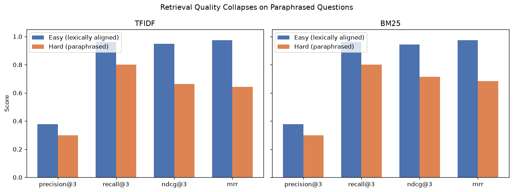
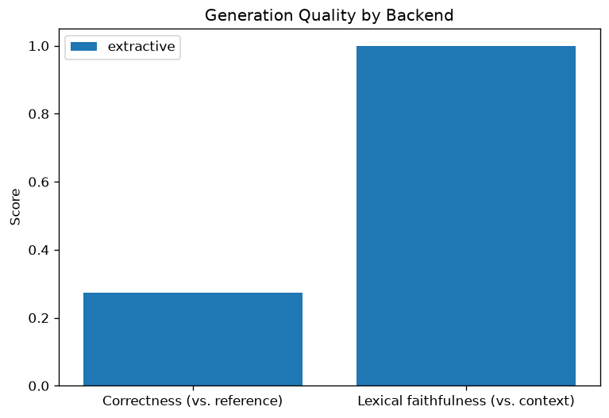

# RAG with a Real Retrieval Evaluation Harness

A retrieval-augmented generation system where the evaluation is the actual
point — not just "does it answer questions," but precision/recall/nDCG at
the retrieval stage, and separately scored correctness and faithfulness at
the generation stage, with a labeled question set built specifically to
expose where retrieval breaks down.

## The result

Retrieval looks excellent on questions that share vocabulary with their
source document — and falls apart on questions that don't:

| | Easy (lexically aligned, n=38) | Hard (paraphrased, n=10) |
|---|---|---|
| nDCG@3 (TF-IDF) | 0.948 | 0.663 |
| nDCG@3 (BM25) | 0.944 | 0.713 |
| MRR (TF-IDF) | 0.974 | 0.642 |
| MRR (BM25) | 0.974 | 0.683 |



This is the single most important finding in this project, and it's also
the most common blind spot in RAG demos: if you only test with questions
that happen to reuse the document's own words, both TF-IDF and BM25 will
look almost perfect. The moment a question is phrased differently from the
source text — which is exactly how real users ask questions — keyword-based
retrieval quality drops by roughly 25-30 points across every metric. BM25
holds up modestly better than TF-IDF on the hard subset (nDCG@3: 0.713 vs.
0.663), consistent with BM25's term-saturation and length-normalization
design, but neither comes close to its easy-question performance.

On generation, the extractive baseline produces a stark, clarifying result:

| | Correctness (vs. reference answer) | Lexical faithfulness (vs. context) |
|---|---|---|
| Extractive | 0.274 | **1.000** |



Faithfulness is perfect by construction — the extractive generator only
ever outputs sentences copied directly from the retrieved context, so it is
mathematically impossible for it to introduce unsupported content. But
correctness is low, because the extracted sentence is usually much longer
and more verbose than the short reference answer, so token-level overlap
with the reference is poor even when the right information was retrieved.
**This is the whole reason these two metrics need to be reported
separately**: an answer can be perfectly grounded and still score poorly on
matching a reference, and an answer can match a reference's wording closely
while still introducing claims the context never made. Neither metric
alone tells the full story.

## What's being evaluated, and on what data

- **Corpus**: 38 short, hand-written documents covering ML and statistics
  concepts (precision/recall, overfitting, propensity score matching,
  transformers, BM25 itself, and so on — see `data/corpus.json`).
- **Evaluation set**: 48 questions in `data/eval_set.json`, each labeled with
  the document(s) that actually answer it and a short reference answer.
  38 are "easy" (phrased close to the source document's own wording), 10
  are "hard" (deliberately paraphrased to avoid shared vocabulary with the
  source document, while still being answerable from it).

**This is a hand-built evaluation set, not a standard IR benchmark** like
BEIR or MS MARCO. That's a deliberate, stated tradeoff, not an oversight:
standard benchmarks are hosted in places this project's build environment
couldn't reach, and a small, fully-inspectable labeled set — where anyone
can open the JSON and check exactly what's being measured and why — is more
useful for understanding what the metrics actually mean than a black-box
download would have been. It is, however, small. See
[Limitations](#limitations) for what that does and doesn't support claiming.

## Method

**Retrieval** — two interchangeable retrievers, implemented in
`src/retriever.py`:
- **TF-IDF + cosine similarity**, the classic vector-space baseline.
- **BM25**, which improves on plain term-frequency scoring with length
  normalization and term-frequency saturation.

**Retrieval metrics** — implemented from scratch in `src/evaluation.py`,
not imported from a library, because the formulas are short and writing
them out is the actual point of building an evaluation harness:
- **Precision@k / Recall@k** — standard set-overlap metrics.
- **MRR** (Mean Reciprocal Rank) — rewards finding *a* relevant document
  early, regardless of how many relevant documents exist.
- **nDCG@k** — rewards relevant documents for appearing *early*, not just
  for appearing somewhere in the top k.

**Generation** — pluggable backends in `src/generator.py`:
- **Extractive** (default, no setup required): picks the most relevant
  sentence(s) out of the retrieved documents via TF-IDF similarity to the
  query. Always grounded, never able to phrase things naturally or
  synthesize across documents.
- **Claude API** (optional): set `ANTHROPIC_API_KEY` and the pipeline will
  also generate and score answers using Claude, prompted to answer strictly
  from the retrieved context.

**Generation scoring** — in `src/faithfulness.py`:
- **Correctness**: token-level F1 between the generated answer and the
  reference answer (the same style of metric used by the SQuAD benchmark).
- **Lexical faithfulness**: the fraction of the answer's substantive words
  that actually appear in the retrieved context — a proxy for groundedness,
  not a guarantee of it (see Limitations).
- **LLM-judge faithfulness** (optional, only runs with an API key): asks
  Claude to directly rate whether an answer is supported, partially
  supported, or unsupported by the retrieved context — a more semantic
  check than lexical overlap, at the cost of needing an API call per answer.

## Limitations

- **The evaluation set is small (48 questions) and hand-built by one
  person**, including the difficulty labels. It's useful for showing
  *relative* differences between methods and exposing a real failure
  mode (paraphrase sensitivity), but the absolute numbers shouldn't be
  read as "BM25 is a 0.896 nDCG retriever" in any general sense — they're
  specific to this corpus and these questions.
- **Lexical faithfulness is a proxy, not a hallucination detector.** It
  checks whether an answer's words appear somewhere in the retrieved
  context, which means an answer that reuses real context words but
  combines them into a claim the context never actually made would still
  score as "faithful." The optional LLM-judge faithfulness check is more
  resistant to this failure mode, but it wasn't run by default in the
  results above, since it requires an API key.
- **Only 10 "hard" questions exist**, all written by the same person who
  wrote the corpus. A larger, independently-written paraphrase set would
  give a more reliable estimate of how much retrieval quality really drops
  — the direction of the effect (it drops) is clear; the precise size of
  the drop is not pinned down to the last decimal by 10 examples.
- **Neither retriever uses semantic embeddings.** TF-IDF and BM25 are both
  fundamentally keyword-matching methods, which is exactly why they
  struggle on paraphrased questions — they have no way to know "flop on the
  real exam" and "high test error" are related ideas if the words don't
  overlap. A dense embedding retriever (or a hybrid of lexical + dense)
  would be the natural next step to address this specific, demonstrated
  weakness, rather than a generic "could be improved" gesture.

## Project structure

```
rag-eval/
├── run_evaluation.py        # end-to-end pipeline — run this
├── app.py                   # interactive Streamlit demo
├── data/
│   ├── corpus.json           # 38 hand-written knowledge base documents
│   └── eval_set.json         # 48 labeled questions (38 easy + 10 hard/paraphrased)
├── src/
│   ├── corpus.py              # loading utilities
│   ├── retriever.py           # TF-IDF and BM25 retrievers
│   ├── evaluation.py          # precision@k, recall@k, MRR, nDCG@k — from scratch
│   ├── generator.py           # extractive + optional Claude API generation
│   ├── faithfulness.py        # correctness and faithfulness scoring
│   └── visualize.py           # all the plots
├── tests/
│   └── test_metrics.py        # hand-computed checks for every metric
├── results/                   # generated tables + figures
└── requirements.txt
```

## Running it

```bash
pip install -r requirements.txt
python run_evaluation.py
```

This regenerates everything in `results/` from the raw corpus and eval set
— nothing is cached or checked in stale.

To also run the optional Claude generation backend and LLM-judge
faithfulness check:

```bash
export ANTHROPIC_API_KEY=your-key-here   # Windows: set ANTHROPIC_API_KEY=your-key-here
python run_evaluation.py
```

To try the interactive demo:

```bash
streamlit run app.py
```

To run the test suite:

```bash
pip install pytest
pytest tests/ -v
```

The tests check the metric formulas against hand-computed expected values
(for example, nDCG@3 on a small ranked list with a known relevant document
at rank 2), not just that the code runs without crashing.

## References

- Robertson, S., & Zaragoza, H. (2009). The Probabilistic Relevance
  Framework: BM25 and Beyond. *Foundations and Trends in Information
  Retrieval*.
- Lewis, P., et al. (2020). Retrieval-Augmented Generation for
  Knowledge-Intensive NLP Tasks. *NeurIPS*.
- Rajpurkar, P., et al. (2016). SQuAD: 100,000+ Questions for Machine
  Comprehension of Text. *EMNLP*. (Source of the token-F1 correctness
  metric used here.)
- Es, S., et al. (2023). RAGAS: Automated Evaluation of Retrieval Augmented
  Generation. (Inspiration for separating faithfulness from correctness,
  and for the LLM-judge faithfulness approach.)
